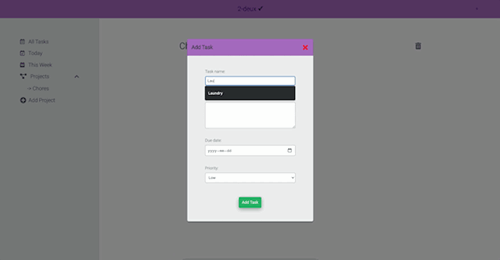

My first project using JavaScript.

A todo list app where users can add custom todos with descriptions, due dates, and priority levels. Filter through tasks via project subfolders.

Live demo: [tynasello.github.io/to-do-app/](tynasello.github.io/to-do-app/) (hosted on GitHub Pages)

### Built With

- Vanilla JavaScript
- Webpack
- HTML5
- CSS3

---

Acknowledgments

Inspiration for this project was found while following the tutorials on https://www.theodinproject.com/dashboard and advancing to the https://www.theodinproject.com/paths/full-stack-javascript/courses/javascript/lessons/todo-list section
